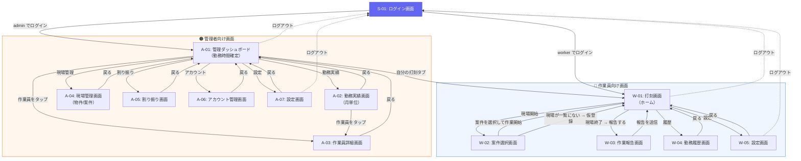

# 画面遷移図（Mermaid版）

> `screens.md` の画面一覧・遷移テーブルに基づき、Mermaid形式で図化したもの。
> GitHubまたはVS Codeのプレビューで図として表示されます。

---

## 全体遷移図

---

## 凡例

| 記号 | 意味 |
|------|------|
| 実線矢印 `→` | 通常の画面遷移（ボタン操作等） |
| 点線矢印 `⇢` | ログアウト（確認ダイアログあり） |
| 🔵 青エリア | 作業員向け画面 |
| 🟠 橙エリア | 管理者向け画面 |
| 🟣 紫ノード | 共通画面（ログイン） |

---

> 詳細な遷移条件（ボタンごとの遷移先・条件）は [screens.md](./screens.md) の「画面遷移図（詳細：ボタン → 遷移先）」セクションを参照。
